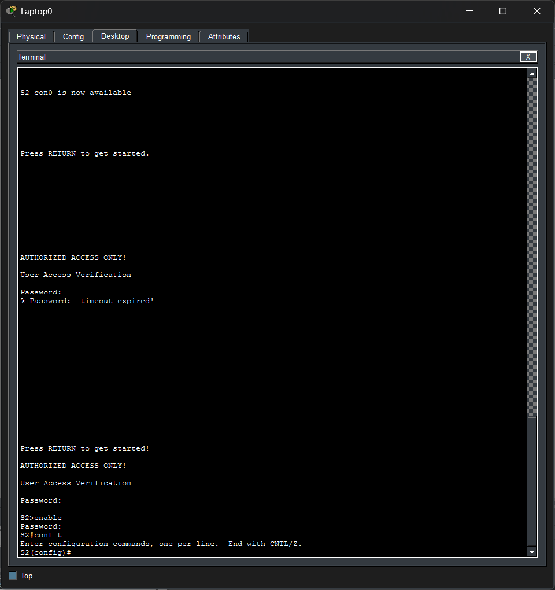
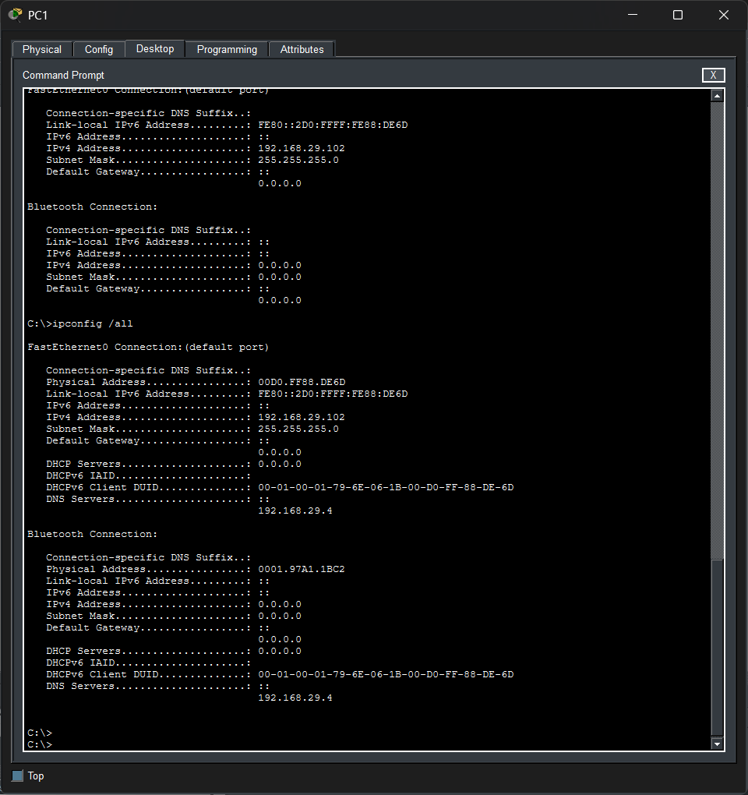
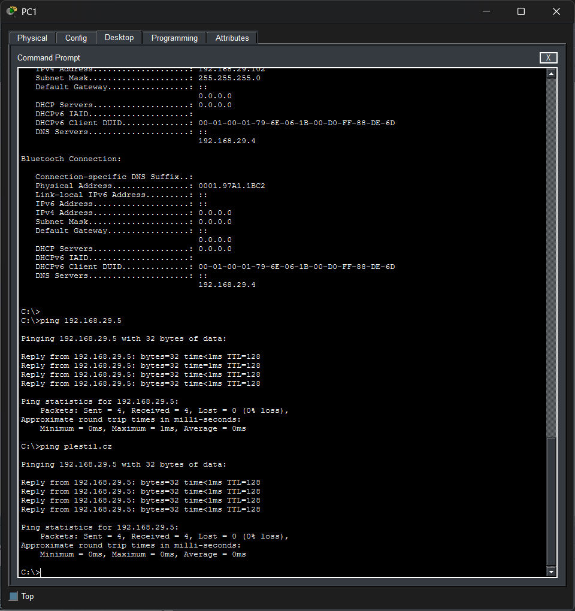
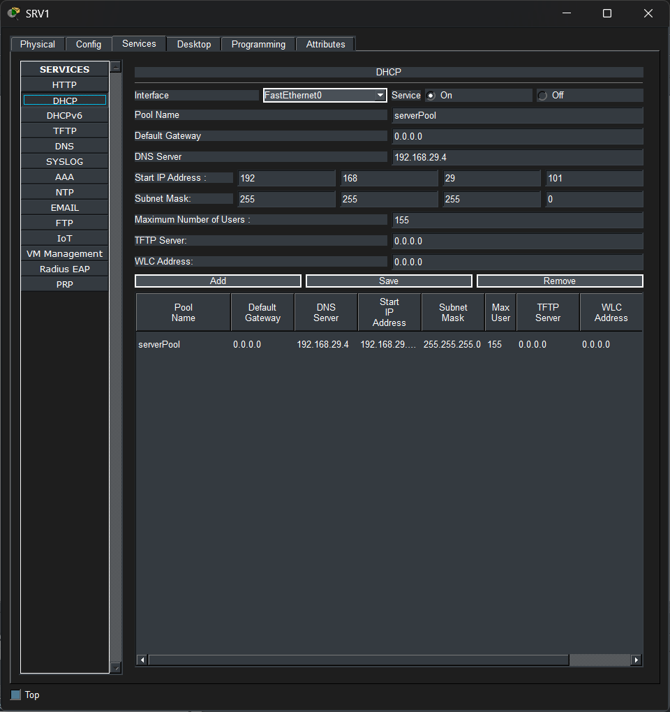
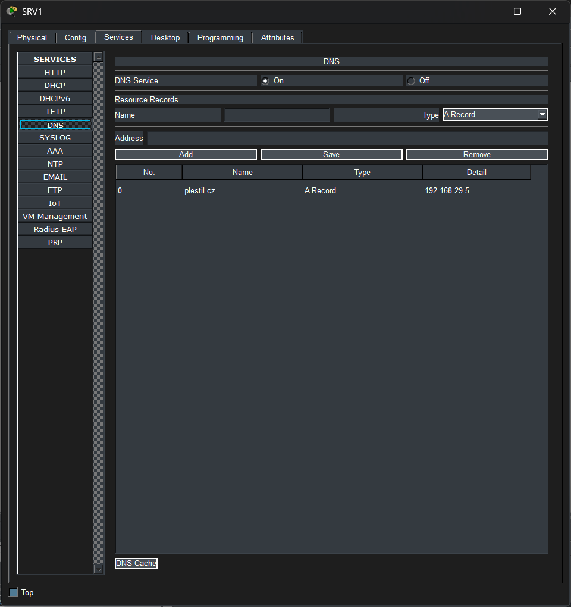
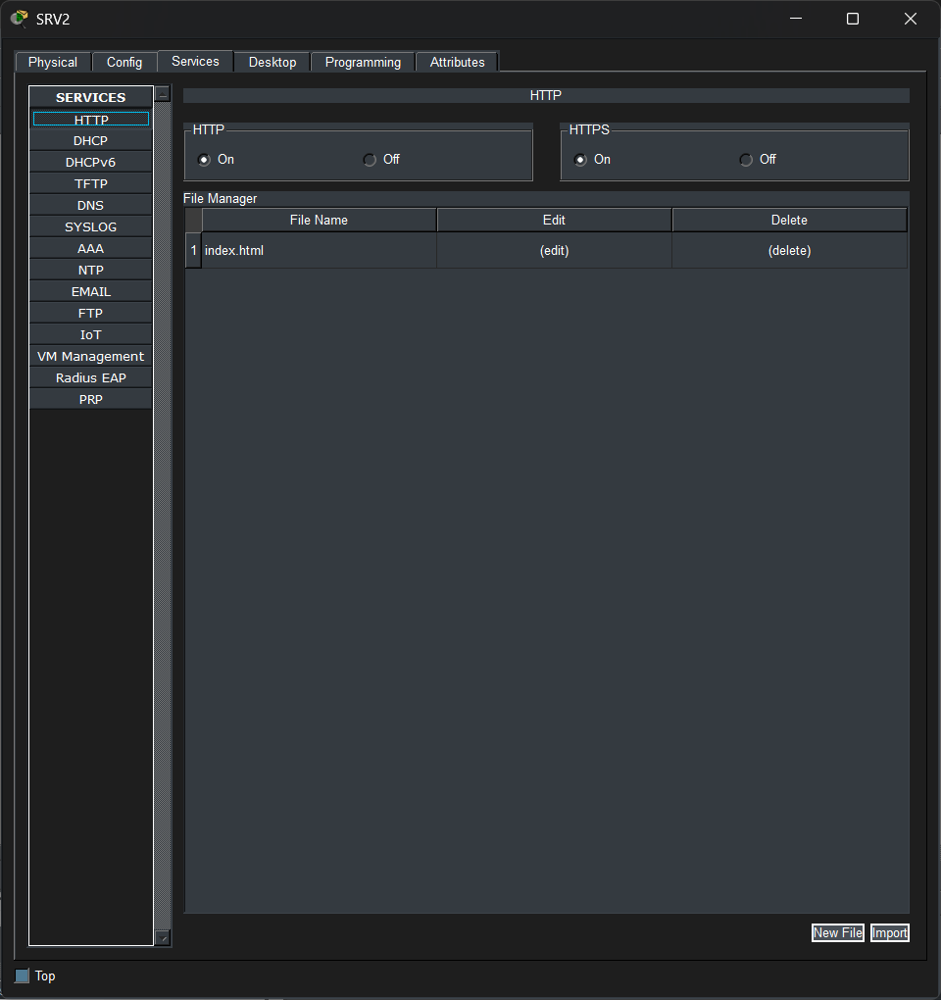

# Packet Tracer - LAN
## Popis sítě
- Switche obsahují základní nastavení a mají nastavenou IP adresu
- PC1 a PC2 jsou zapojeny do S1
- SRV1 a SRV2 jsou zapojeny do S2
- Na SRV1 běží DHCP server a DNS server, na S2 běží web server
- Všechny zařízení v síti mají kromě PC2 statickou IP adresu
- IP adresy jsou v sítí 192.168.29.0/24
## Výpočet X
| Písmeno | ASCII |
|---------|-------|
| P       | 80    |
| L       | 76    |
| E       | 69    |
| S       | 83    |
| T       | 84    |
| I       | 73    |
| L       | 76    |

80 + 76 + 69 + 83 + 84 + 73 + 76 = 541\
541 mod 256 = 29\
**X = 29**
## Snímky obrazovky

## Licence
Repozitář je licencován pod MIT License